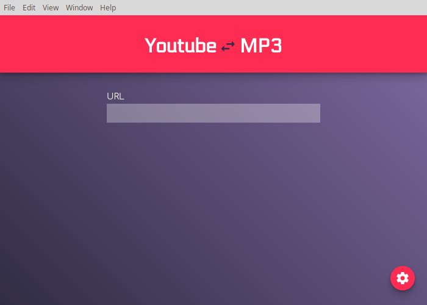
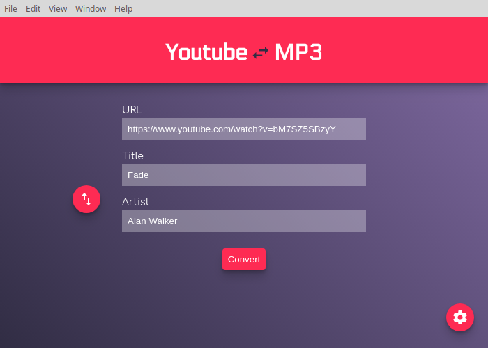

# YouTube to MP3
Electron Application to convert YouTube videos to MP3 Easily.
Uses FFmpeg binaries for the conversion process, and integrates nicely with the OS,
allowing users to easily choose save directory and autofill url on hover. Artist and
title are auto-filled, and desktop notifications signify a completed conversion.
(not on Windows as that requires a cert.)

<p align="center">
  
</p>
<p align="center">
  
</p>

## Project setup
```
npm install
```

### Compiles and hot-reloads for development
```
npm run electron:serve
```

### Compiles and minifies for production
```
npm run electron:build
```